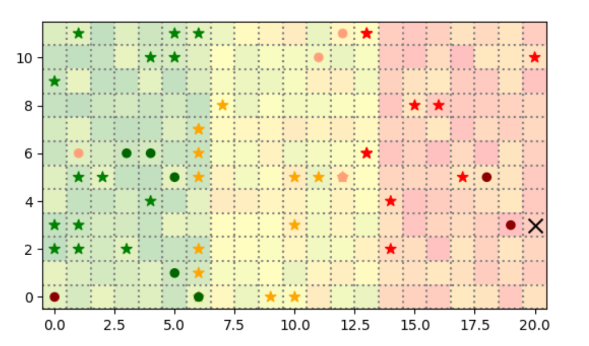
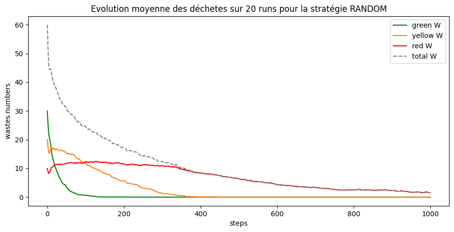
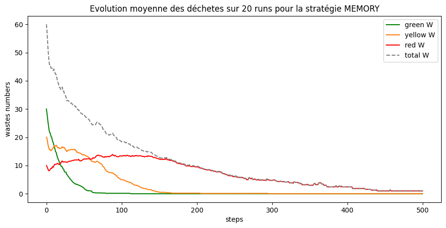
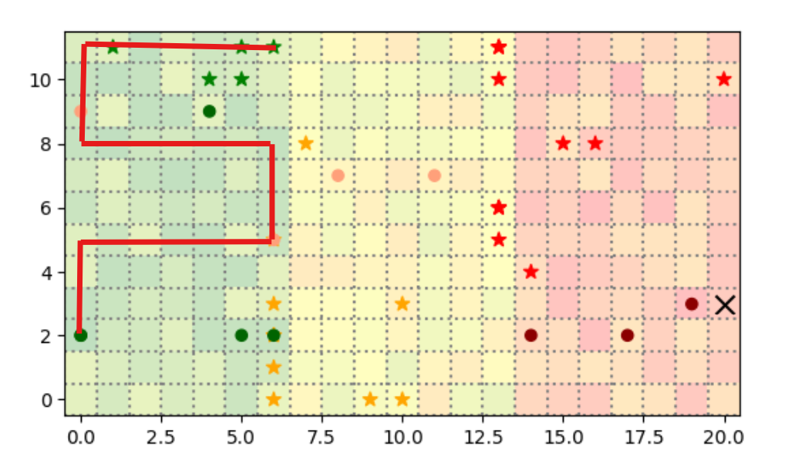
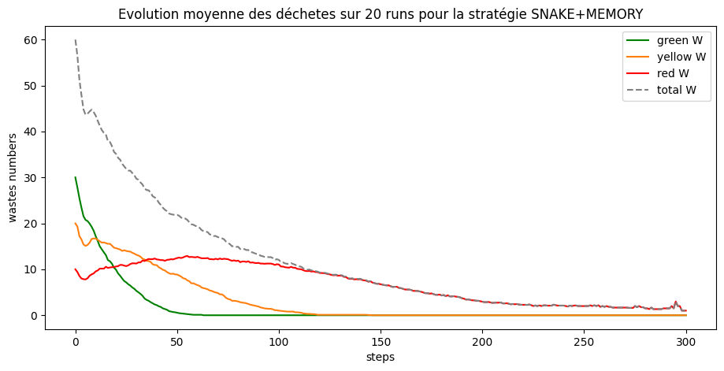

# Multi-Agent System Course
This is a repository for the Multi-Agent System (MAS) project for the academic year 2024-2025. 

Ceci est un repertoire pour le projet du cours Systemes multi-agent (SMA)  pour l'année académic 2024-2025

<div align="center">
    </img>
</div>

Ce projet consiste à réaliser une simulation de robot ramasseur de déchets dans des zones plus ou moins radioactives, et d'implémenter et comparer différentes stratégies de ramassage pour les robots.

Pour une facilité de lecture les consignes précises de l'exercice sont rappelés à la fin de ce readme.

On présente d'abord les stratégies implémentés et les résultats associés, puis le protocole et les spécificité de notre implémentation, et enfin la consigne donné par les professeur-e-s.

## Utilisation

Dans 'robot_mission_9' vous trouverez le fichier 'run.py' qui permet de lancer la simulation.

lancer la simulation avec la commande suivante:

```bash
solara run robot_mission_9/run.py
```
Cela va lancer un serveur web sur le port 8080, vous pouvez ensuite visualiser la simulation en vous rendant à l'adresse suivante:

Pour génerer les graphiques de comparaison entre les stratégies, il faut executer le fichier run `robot_mission_9/run_without_solara.ipynb` qui lance le modèle 20 fois avec des random_seed différentes et qui génère les graphique moyen de performance.

Pour changer les stratégies il faut modifier la méthode déliberate dans la classe Robot dans le fichier `robot_mission_9/agents.py`.


## Strategies et résultats

On compare 3 stratégie de la plus simple à la plus compelxe, ci-dessous un tableau avec un comparatif des stratégies:

| Stratégie             | Description                                             | Ramassage total | Temps moyen (steps) | Observations principales                                           |
|-----------------------|---------------------------------------------------------|------------------|----------------------|--------------------------------------------------------------------|
| Recherche Aléatoire   | Déplacement aléatoire pour trouver les déchets          | ❌               | ~1000                | Très lente, inefficace pour les robots rouges                      |
| Mémoire des déchets   | Les robots mémorisent les déchets vus                   | ✅               | ~500-700             | Amélioration nette, surtout en début de simulation                 |
| Stratégie "Serpent"   | Parcours systématique pour couvrir toute la zone        | ✅               | ~250-300             | Meilleure efficacité globale, déchets ramassés très rapidement     |


### Random search

#### Description

Comme élement de comparaison, on implémente une stratégie minimale, comme le comportement aléatoire total donnerai peu de résultats, le robot est se déplace aléatoirement seulement pendant sa période de recherche de déchet, et suit une logique lors de la livraison du déchet.

Description de la stratégie:

**Mode "vide":**

- tous les robots: le robot se déplace aléatoirement dans un espace de moore, lorsqu'il observe un dechet de sa couleur dans son espace de moore il le récolte, si il est plein il passe en mode 'plein'

**Mode "plein":**

- robots verts et jaunes: le robot se déplace vers la droite tant qu'il est en capacité de le faire, lorsqu'il ne peut plus, il compacte ses 2 déchets en 1 seul de la couleur supérieur et le dépose.

- robots rouges: le robot se déplace vers la droite jusqu'au bord du terrain, puis scan le bord droit pour trouver la zone de dépot (en se déplaçant vers le bas puis vers le haut). Une fois qu'il l'a trouvé, il dépose le déchet et mémorise la position de la zone de dépot

#### Resultats

<div align="center">
    </img>
</div>

On a arrété artificiellement la stratégie à 1000 steps car les robots rouges mettent beaucoup de temps à trouver les derniers déchets. On voit que la stratégie réussi quand même à ramasser la plupart des déchets, mais met beaucoup de temps à le faire.

Ce résultat nous servira de base de comparaison

### Memorise waste position

#### Description

Dans cette stratégie la seule différence avec la stratégie précédente (random), c'est que les robots sont en capacité de mémoriser la position des déchets qu'ils croisent en cours de route, lorsqu'ils sont en mode "vide", il se dirigent d'abord vers la position du déchet le plus proche qu'il ont en mémoire pour essayer de le ramasser, et ainsi de sutie. Si ils n'ont rien en mémoire ils se deplacent aléatoirement.

#### Resultats

<div align="center">
    </img>
</div>

On observe une très nette amélioration des résultats. Ce qui est remarquable c'est que les courbes d'évolutions des déchets ont sensiblement la même forme mais elles évoluent 2 fois plus vite et les déchets sont ramassés 2 fois plus rapidement avec cette simple modification !

De plus, les robots arrivent à ramasser l'integralité des déchets cette fois, et sur les 20 runs menés, le plus lent des modèle a mit 700 étapes pour ramasser tout les déchets, bien moins que précedemment.

### Snake strategy

#### Description

Pour cette stratégie, on rajoute un peu de logique en supprimant les mouvement aléatoire. A la place, lorsque les robots n'ont pas de cases "objectif", ils se déplacent comme des "serpents" de manière à scanner tout leur environnement.

<div align="center">
    </img>
</div

Ci dessus on montre un parcours théorique en rouge, théorique car dès qu'il rencontrera un déchet compatible le robot arrêtera son parcours pour s'occuper du déchet.

#### Resultats

<div align="center">
    </img>
</div>

On observe toujours les même formes de courbes mais on diminue le temps maximal à 300 steps et le temps moyen à environs 250 steps, donc on parviens encore à réduire de moitié le temps de ramassage les déchets.

On obserce aussi un applatissement de la courbe de ramassage des déchets jaunes, ce qui semble dire que les robots jaunes parviennent à ramasser les déchets plus vite qu'ils ne sont crée par les robots verts. Ceci témoigne d'une meilleur efficacité puisque la courbe est bien plus concave dans les autres stratégies.

### Limites des stratégies actuelles

La limite la plus impotante est la difficulté des robots rouges à ramasser leur déchets, en effet on observe sur les courbes qu'ils sont très rapidement les facteurs limitant du ramassage.

Ceci s'explique car les stratégies mises en place pour la recherche des déchets sont peu efficaces pour eux, en effet leur zone de déplacement est pour eux beaucoup plus grande que pour les autre robots comme elles inclue la zone des autres robots. Peut être que réaliser un serpentin vertical au lieu d'horizontal pourrait améliorer les resultat dans notre cas (mais cela serait un peu de la triche au vu de la connaissance des robots).

### Pour aller plus loin

- la mise en place de la communication entre les robots pour partager et mettre à jour la position des déchets permettrai à coût sur une amélioration drastique des performances

- l'étude de l'importance des hyperparamêtres comme le nombre de robots ou le nombre de déchets ainsi que la taille de la grille serrait très pertinant. En particulier car dans une application industrielle ce serait les paramêtres les plus important à déterminer optimalement, de plus dans cet exemple et avec nos hyperparametres on voit très clairement que le nombre de robot rouges est un facteur limitant

## Spécificité de notre modélisation

### choix et hyperparamêtres

On fixe (aribtrairement) les hyperparametres suivant pour permettre la comparaison entre les stratégies.

    "seed": 42, #seulement pour la simulation avec visualisation
    "width": 21,
    "height": 12,
    "n_green_robots": 5,
    "n_yellow_robots": 4,
    "n_red_robots": 3,
    "n_green_wastes": 30,
    "n_yellow_wastes": 20,
    "n_red_wastes": 10,

La zone de dépot est une case unique situé sur la bordure droite de la grille

### Génération des résultats

On base la comparaison de nos stratégies sur le temps que les robots mettent à ramasser les déchets.

On aurait aussi put s'intéresser à la distance totale parcouru par les robot pour ramasser les déchets, c'est pourquoi on collecte la distance des robots dans notre modèle et qu'elle est affiché sur la page de visualisation. Cependant pour les stratégies que nous avons essayés, les robots bougent à presque toutes les étapes donc le temps et la distance sont des métriques équivalentes. Avec des stratégies plus évolués cela ne serait pas forcément le cas, par exemple avec la communication des robots que nous n'avons pas eu le temps d'implémenter.

Pour récupérer les résultats, on lance 20 simulations avec des random_seed différentes et on moyenne les résultats à chaque step.

### implémentation

On implémente les agents (Robots) et l'environnement indépendamment les uns de l'autres, et suivant les spécificité suivantes:

- l'environnement est commun à tous les agents
- c'est l'environnement qui crée ou supprime les agents
- l'environnement fournis aux agent leurs perceptions (feature + zone)
- les agens délibère d'une action à réaliser sur la base de leur perception et de leurs connaissances (mémoire ou connaissance absolue)
- l'action choisi est communiqué à l'environnement qui execute l'action

Dans notre implémentation les action sont des fonctions de la forme 

```python
def action(model,agent):
    ...
```

qui executent les actions sur l'agent et sur le modèle. Ces fonctions ont un droit d'accès total sur le modèle et sur l'agent comme elles sont un "intermédiaire". 
En particulier ces fonction sont executés par l'environnnement après leur avoir été communiqué sur lui même et sur l'agent en question.

PS: dans notre implémentation on a crée un décorateur pour gérer le logging des actions si elles echouent et pour pouvoir ajouter des attributs supplémentaires:

```python
@action
def action(model,agent,ar1,arg2,*args):
    ...
```


## Consignes

In this project, you will model the mission of robots that have to collect dangerous waste, transform it, and then transport it to a secure area. The robots navigate in an environment broken down into several zones where the level of radioactivity varies from low radioactive to highly radioactive. Not all robots have access to all areas.

### Environment

The environment is decomposed into three zones (from west to east):
1. **Zone 1**: Area with low radioactivity, containing a random number of initial (green) waste.
2. **Zone 2**: Area with medium radioactivity.
3. **Zone 3**: The last area with high radioactivity, where completely transformed wastes must be stored.

### Waste Types

We have three different types of waste:
- Green waste
- Yellow waste
- Red waste

### Robot Types

We have three different types of robots:

#### Green Robot
- Walk to pick up 2 initial wastes (i.e., green).
- If in possession of 2 green wastes, then transform them into 1 yellow waste.
- If in possession of 1 yellow waste, transport it further east.
- Green robot cannot exceed Zone 1.

#### Yellow Robot
- Walk to pick up 2 initial yellow wastes.
- If in possession of 2 yellow wastes, then transform them into 1 red waste.
- If in possession of 1 red waste, transport it further east.
- Yellow robot can move in Zones 1 and 2.

#### Red Robot
- Walk to pick up 1 red waste.
- If in possession of 1 red waste, transport it further east to the “waste disposal zone”, where the waste is then “put away”.
- Red robot can move in Zones 1, 2, and 3.

### Implementation Instructions

You have to create a folder named `robot_mission_9`, which will contain different files. Each file should include the number of the group, the date of creation, and the names of the members of the group at the top.


corrige les fautes